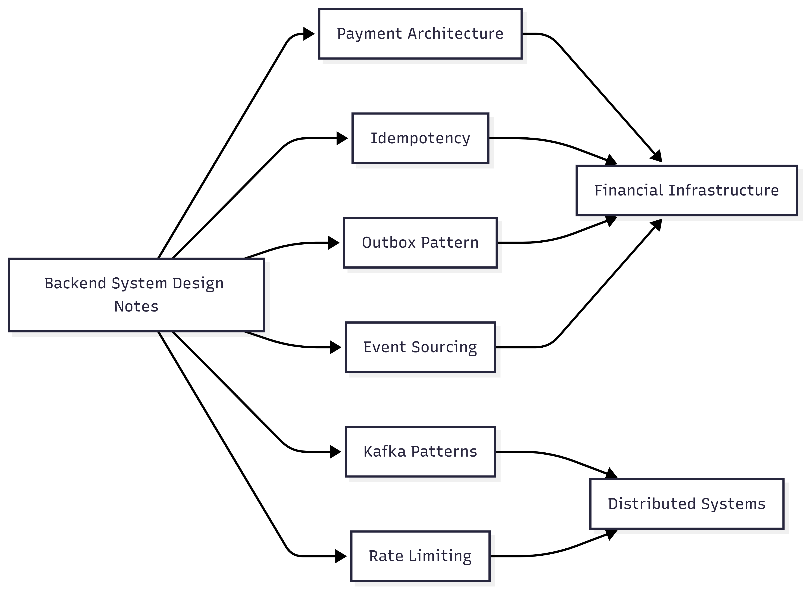

# Backend System Design Notes

A curated collection of practical backend architecture notes covering financial infrastructure, distributed systems, event-driven design, and reliability engineering.

This repository documents patterns and architectural decisions commonly found in production-grade payment systems, cloud-native platforms, and large-scale distributed applications.

---

## Backend System Design Map

The following map provides an overview of the key topics covered in this repository and how they relate to modern backend engineering.



---

## Topics Covered

### Financial Infrastructure

* [Payment Architecture](notes/payment-architecture.md)
* [Idempotency](notes/idempotency.md)
* [Outbox Pattern](notes/outbox-pattern.md)

### Distributed Systems

* [Kafka Patterns](notes/kafka-patterns.md)
* [Event Sourcing](notes/event-sourcing.md)

### API Platform Engineering

* [Rate Limiting](notes/rate-limiting.md)

---

## What You Will Find Here

These notes focus on practical engineering challenges encountered when building reliable backend systems:

* Payment processing workflows
* Event-driven architectures
* Distributed messaging patterns
* Data consistency strategies
* Failure recovery mechanisms
* API resilience and protection
* Scalability considerations
* Reliability and observability

Rather than theoretical concepts, the emphasis is on production-oriented patterns that can be applied to real-world systems.

---

## Core Engineering Domains

### Financial Systems

Designing payment platforms that prioritize consistency, auditability, and fault tolerance.

### Distributed Systems

Building services that communicate asynchronously while remaining scalable and resilient.

### Event-Driven Architecture

Using messaging platforms such as Kafka to decouple services and improve system flexibility.

### Reliability Engineering

Handling failures through retries, dead-letter queues, idempotency, and recovery mechanisms.

### Platform Engineering

Protecting and scaling APIs through rate limiting, observability, and operational best practices.

---

## Repository Structure

```text
backend-system-design-notes/
├── README.md
├── diagram/
│   ├── backend-system-design-map.png
│   ├── payment-processing-architecture.png
│   ├── payment-idempotency-flow.png
│   ├── outbox-pattern-flow.png
│   ├── kafka-retry-and-dlq-flow.png
│   ├── token-bucket-rate-limiting.png
│   └── event-sourcing-flow.png
└── notes/
    ├── payment-architecture.md
    ├── idempotency.md
    ├── outbox-pattern.md
    ├── kafka-patterns.md
    ├── rate-limiting.md
    └── event-sourcing.md

---

## Related Project

This repository complements the Fintech Payment Engine project, where many of these patterns are implemented in a runnable Spring Boot + Kafka + PostgreSQL application.

* Event-Driven Processing
* Transactional Outbox Pattern
* Idempotent Payment APIs
* Kafka Retry & DLQ Strategies
* Prometheus & Grafana Observability

---

## About

**Babacar Niang**

Senior Backend Engineer focused on financial infrastructure, distributed systems, event-driven architecture, and cloud-native platforms.

* LinkedIn: https://www.linkedin.com/in/babacar-niang-swe
* GitHub: https://github.com/babacar-niang
